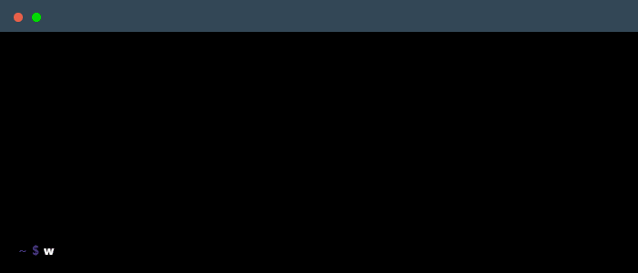

    

 

<h3 class="heading-element" dir="auto">Main skills</h3>

  

 

<h3 class="heading-element" dir="auto">Studying</h3>

  

 

<h3 class="heading-element" dir="auto">About me</h3>

👋 Hi! I'm a full-stack developer with 3+ years of impactful experience in fintech.

🛠️ I work with Angular, Node.js, TypeScript, MongoDB, and GCP, focusing on clean architecture and reliable solutions.

⚡ Random fact - My coding journey started with C and CodeBlocks (those were the days!)

🎮 I believe the best work happens through collaboration – great teams build great things.

 

<h3 align="left">Contact me :</h3>

    
    
    
    

 
 

### 💼 Employer? 
> [!IMPORTANT]  
> <a href="https://docs.google.com/document/d/17e6rIn4Hw9JzVxZA2y6quKKdXr1aZGU5" download>Download my resume</a>

 

    

 

